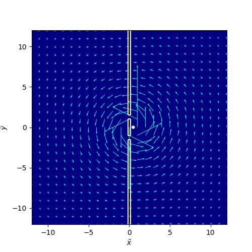

# Simulating the Aharonov-Bohm effect using the Crank-Nicolson scheme

The following implementation has been adapted from the work of [Felix Deschroeters](https://github.com/FelixDesrochers/Electron-diffraction) and [Benjamin Colmey](https://github.com/bcolmey/Aharonov-Bohm-Space-Charge-Effects-in-Python). The Crank-Nicolson (CN) scheme is used to solve the minimal coupling rule in an attempt to simulate the Aharonov-Bohm effect - a quantum phenomenon demonstrating the physical significance of electromagnetic potentials, even in regions where their respective electromagnetic fields are zero. 

This is a short summary. The full report can be read [here](AB_report.pdf).

### Minimal coupling

The wavefunction of a non-relativistic quantum system is governed by the Schrödinger equation $(\text{SE})$

$$
i \hbar \frac{d}{dt} \Psi = \hat{H}\Psi,
$$

where $\hat{H}$ is the Hamiltonian of the system. Consider a particle with charge $q$ moving in an electric field $\mathbf{E}$ and magnetic field $\mathbf{B}$. The fields are given by

$$
    \mathbf{E} = -\nabla \phi - \partial_t\mathbf{A} \quad  \text{and}
$$
$$
    \mathbf{B} = \nabla \times \mathbf{A},
$$

where $\phi$ is the electric potenital and $\mathbf{A}$ is the magnetic vector potential. The Hamiltonian is given by

$$
    \hat{H} = \frac{1}{2m} (-i \hbar \nabla - q\mathbf{A})^2 + q\phi + V.
$$

This, combined with $(\text{SE})$ is commonly known as the *minimal coupling rule* $[2]$:

$$
    i \hbar \frac{d}{dt} \Psi = \left[\frac{1}{2m} (-i \hbar \nabla - q\mathbf{A})^2 + q\phi + V\right]\Psi.
$$

As opposed to $\mathbf{E}$ and $\mathbf{B}$, the potetials $\phi$ and $\mathbf{A}$ in electrodynamics are *not* physical fields. However, in quantum mechanics they play a more direct role, as can be seen in the minimal coupling rule. A physical consequence ofthis was demonstrated by physicists Yakir Aharonov and David Bohm in 1959 $[5]$, when they showed that the vector potentials can affect the quantum-mechanical behavior of charged particles, even when confined to a region where $\mathbf{E}$ and $\mathbf{B}$ are zero.

### Scaling of the diffierential equation

We can make the minimal coupling rule dimensionless by introducing the following parameters

$$
    \tau \equiv \frac{t}{t_c}, \quad \tilde{x} \equiv \frac{x}{l_c}, \quad  \quad \tilde{y} \equiv \frac{y}{l_c} \quad \text{and} \quad \tilde{\mathbf{A}} \equiv \frac{\mathbf{A}}{A_c},
$$

where $\tau$ and $x_c$ and $y_c$ are natural length and timescales of the problem, defined by 

$$
    t_c \equiv \frac{m}{A_cq}l_c, \quad l_c \equiv \frac{\hbar}{A_c q} \quad \text{with} \quad A_c \equiv \mu_0I_0.
$$

Inserting the terms into the minimal coupling rule, dividing by $m/A_c^2q^2$ and setting $\phi = 0$ (this potential term will not be relevant in the following) the *dimensionless minimal coupling rule* now reads

$$
    i\frac{d\Psi}{d\tau} = \left[\frac12(-i\tilde{\nabla}-\tilde{\mathbf{A}})^2 + \tilde{V}\right]\Psi \equiv \tilde{H}\Psi,
$$

where

$$
    \tilde{V} \equiv \frac{V}{V_c}, \quad \text{with} \quad V_c \equiv \hbar/t_c.
$$

### Solving the 2D SE with minimal coupling using the CN scheme

The CN method is an implicit, second-order time integration method that uses centered differences. The dimensionless minimal coupling rule is approximated as

$$
    i\frac{\Psi^{n+1} - \Psi^n}{\Delta \tau} = \frac{1}{2} \tilde{H}_{disc} (\Psi^{n+1} + \Psi^n),
$$

where $\tilde{H}_{disc}$ is the discretized dimensionless hamiltonian. We see that the right-hand-side is an average between the backward and forward Euler methods. Collecting like terms, we obtain the CN matrix system

$$\left(I + \frac{i\Delta \tau}{2}\tilde{H}_{disc}\right)\Psi^{n+1} = \left(I - \frac{i\Delta \tau}{2}\tilde{H}_{disc}\right)\Psi^n$$

$$A\Psi^{n+1} = M\Psi^n$$

Expanding $\tilde{H}$, using the *Coulomb gauge* ($\nabla \cdot \mathbf{A} = 0$) and discretizing the laplacian and momentum coupling term using a five-point stencil, the matrix system is given by

**Diagonal term**:
$$\{i - 4\alpha - \Delta\tau[\frac{1}{2}(\tilde{A}_x^2 + \tilde{A}_y^2) - \tilde{V}]\}\Psi_{i,j}$$

**Neighbor terms (n+1)**:
$$\begin{aligned}
&+ \{\alpha + i\tilde{A}_x\beta\}\Psi_{i,j+1}^{n+1} + \{\alpha - i\tilde{A}_x\beta\}\Psi_{i,j-1}^{n+1} \\
&+ \{\alpha + i\tilde{A}_y\beta\}\Psi_{i+1,j}^{n+1} + \{\alpha - i\tilde{A}_y\beta\}\Psi_{i-1,j}^{n+1}
\end{aligned}$$

**Right-hand side (n terms)**:
$$\begin{aligned}
&= \{i - 4\alpha - \Delta\tau[\frac{1}{2}(\tilde{A}_x^2 + \tilde{A}_y^2) - \tilde{V}]\}\Psi_{i,j}^{n} \\
&+ \{-\alpha - i\tilde{A}_x\beta\}\Psi_{i,j+1}^{n} + \{-\alpha + i\tilde{A}_x\beta\}\Psi_{i,j-1}^{n} \\
&+ \{-\alpha - i\tilde{A}_y\beta\}\Psi_{i+1,j}^{n} + \{-\alpha + i\tilde{A}_y\beta\}\Psi_{i-1,j}^{n}
\end{aligned}$$

where we have introduced the constants

$$
    \alpha \equiv \frac{\Delta \tau}{4(\Delta l)^2} \quad \text{and} \quad
    \beta \equiv \frac{\Delta\tau}{8\Delta l}.
$$

For simplicity, we have assumed that $\Delta x = \Delta y \equiv \Delta l$. 

It's worth noting that because the CN scheme is numerically implicit, it is computationally expensive. However, when taking a look at the matrix system $\tilde{H}_{disc}$ takes a block-tri-diagonal form. One can therefore take great advantage of the use of sparse matrix storage formats, such as the \textit{compressed sparse column} (CSC) format, which used in the code implementation.

### Results

**Single electron**

*Two-dimensional probability density* $|\Psi|^2$ *of single electron in double-slit diffraction. The blue line indicates the "screen" at* $\tilde{x} = 6.0$ *where the diffraction pattern is measured.*

**Two electrons - The Aharonov-Bohm effect**

$\mathbf{A} = 0$

*Two-dimensional probability density* $|\Psi|^2$ *of two electrons in the double-slit experiment (with* $\mathbf{A} = 0$*). The blue line indicates the "screen" at* $\tilde{x} = 6.0$ *where the diffraction pattern is measured.*

$\mathbf{A} \neq 0$

**Aharonov-Bohm experiment**: *Two-dimensional probability density* $|\Psi|^2$ *of two electrons in double-slit diffraction with* $\mathbf{A} \neq 0$. *The blue line indicates the "screen" at* $\tilde{x} = 6.0$ *where the diffraction pattern is measured. The solenoid is indicated by a white dot.*

*Solenoid vector potential.*

### References

$[1]$ Jean-Pierre Beregner. A perfectly matched layer for the absorption of electromagnetic waves. *Jounal of Computational Physics*,
114(2):185–200, 1994. DOI: https://doi.org/10.1006/jcph.1994.1159

$[2]$ David J. Griffiths and Darrell F. Schroeter. *Introduction to Quantum Mechanics*. Cambridge University Press, 3rd edition, 2018.

$[3]$ David J. Griffiths. *Introduction to Electrodynamics*. CambridgeUniversity Press, 5th edition, 2023

$[4]$ Hans P. Langtangen and Geir K. Pedersen. *Scaling of Differential Equations*. SpringerOpen, 2016.

$[5]$ Yakir Aharonov and David Bohm. Significance of electromagnetic potentials in the quantum theory. *Physical Review*, 115(3):485–491, 1959. DOI: https://doi.org/10.1103/PhysRev.115.485.